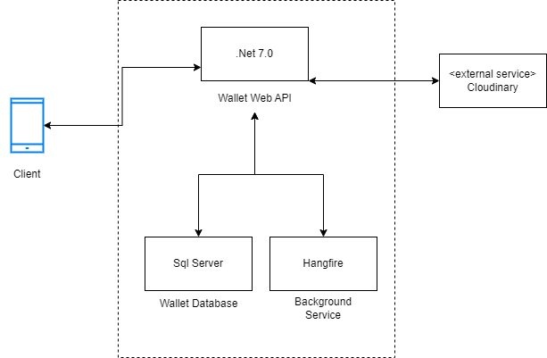
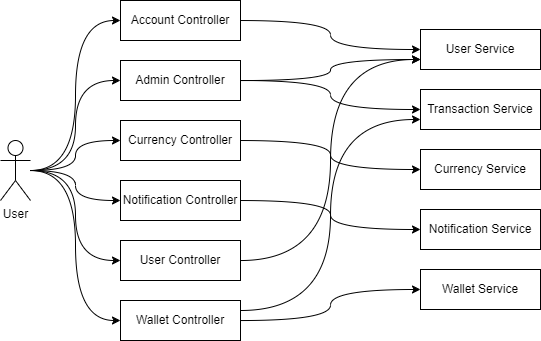

# SBSC.Wallet

## SYSTEM ARCHITECTURE

### COMPONENTS BREAKDOWN

The solution is built with C# running on .Net 7.0 and the database is MSSQL database.

#### COMPONENTS

- Newtonsoft.Json 13.0.3
  - A popular high-performance JSON framework for .NET. This is used for manipulating JSON.
- Hangfire 1.7.34
  - An easy and reliable way to perform fire-and-forget, delayed and recurring, long-running, short-running, CPU or I/O intensive tasks inside ASP.NET applications. This is used for scheduling tasks.
- EntityFrameworkCore 7.0.4
  - Entity Framework Core is a modern object-database mapper for .NET.
- ClosedXML 0.101.0
  - For exporting data to Excel.
- CloudinaryDotNet 1.20.0
  - This is used for file storage.
- AutoMapper 12.0.0
  - A convention-based object-object mapper. This is used for cast an object to another object.
  
### Division of Code

The main projects are the **YomiOlatunji.Wallet.Api**. This handle the requests from the API clients then passes the data to the **YomiOlatunji.Wallet.BusinessCore** to process the requests.
Here is a call diagram/workflow of the API to the BusinessCore.

## Endpoints

Here is a list of the Endpoints

- **Account**
  - *POST* /api/Account/login
  - *POST* /api/Account/change-password
  - *POST* /api/Account/admin/login
- **Admin**
  - *POST* /api/Admin
  - *POST* /api/Admin/superadmin
  - *POST* /api/Admin/user/activate
  - *POST* /api/Admin/user/deactivate
  - *GET*  /api/Admin/transactions/download
- **Currency**
  - *GET* /api/Currency
  - *POST* /api/Currency
- **Notification**
  - *GET* /api/Notification
  - *GET* /api/Notification/{id}
- **User**
  - *GET* /api/User
  - *POST* /api/User
  - *PUT* /api/User
- **Wallet**
  - *GET* /api/Wallet
  - *POST* /api/Wallet
  - *GET* /api/Wallet/user/{userId}
  - *POST* /api/Wallet/credit-wallet
  - *POST* /api/Wallet/debit-wallet
  - *GET* /api/Wallet/user-transactions
  - *GET* /api/Wallet/{walletId}/transactions

## DATABASE DESIGN

The DBMS used for this solution is Microsoft SQL Server. The database name is **Wallet**.
The database has the following tables.

|TABLE_CATALOG|TABLE_SCHEMA|TABLE_NAME      |
|-------------|------------|----------------|
|Wallet       |DBO         |Admins          |
|Wallet       |DBO         |Audits          |
|Wallet       |DBO         |Currencies      |
|Wallet       |DBO         |InterestPayables|
|Wallet       |DBO         |Notifications   |
|Wallet       |DBO         |Transactions    |
|Wallet       |DBO         |Users           |
|Wallet       |DBO         |Wallets         |

## Source Code Report/Software Measurements

- **Maintainability Index** – Calculates an index value between 0 and 100 that represents the relative ease of maintaining the code. A high value means better maintainability. Color coded ratings can be used to quickly identify trouble spots in your code. A green rating is between 20 and 100 and indicates that the code has good maintainability. A yellow rating is between 10 and 19 and indicates that the code is moderately maintainable. A red rating is a rating between 0 and 9 and indicates low maintainability.
- **Cyclomatic Complexity** – Measures the structural complexity of the code. It is created by calculating the number of different code paths in the flow of the program. A program that has complex control flow will require more tests to achieve good code coverage and will be less maintainable.
- **Depth of Inheritance** – Indicates the number of class definitions that extend to the root of the class hierarchy. The deeper the hierarchy the more difficult it might be to understand where particular methods and fields are defined or/and redefined.
- **Class Coupling** – Measures the coupling to unique classes through parameters, local variables, return types, method calls, generic or template instantiations, base classes, interface implementations, fields defined on external types, and attribute decoration. Good software design dictates that types and methods should have high cohesion and low coupling. High coupling indicates a design that is difficult to reuse and maintain because of its many interdependencies on other types.
- **Lines of Code** – Indicates the approximate number of lines in the code. The count is based on the IL code and is therefore not the exact number of lines in the source code file. A very high count might indicate that a type or method is trying to do too much work and should be split up. It might also indicate that the type or method might be hard to maintain.

Using the Visual Studio Code Metrics  and the definitions above, here are the reports for the respective projects.

|Project      |Maintainability Index|Cyclomatic Complexity|Class Coupling|Depth of Inheritance|Lines of Code|
| ------------| --------------------|---------------------|--------------|--------------------|-------------|
| API         |61                   | 91                  |2             |134                 |745          |
| CoreObject  |96                   | 230                 |3             |23                  |463          |
| BusinessCore|80                   |455                  |2             |170                 |1877         |
